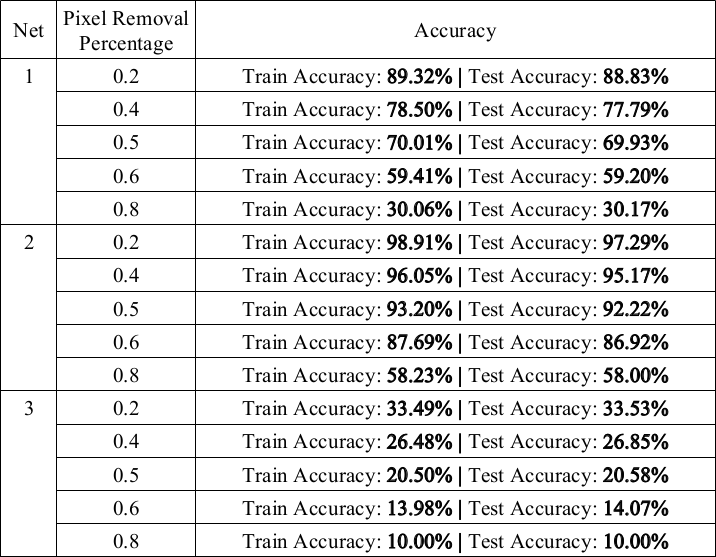
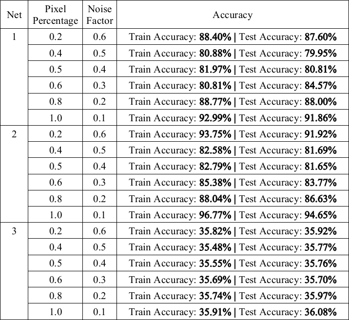
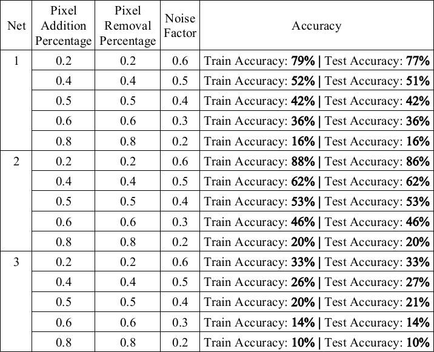
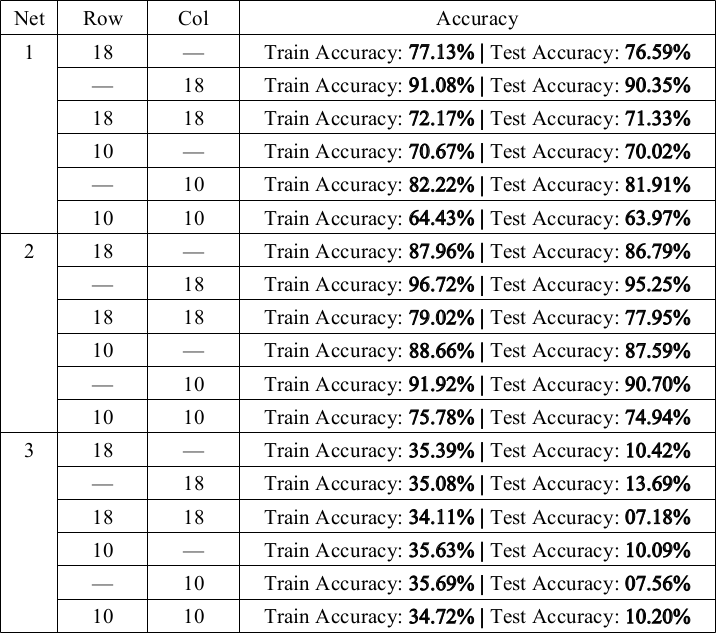
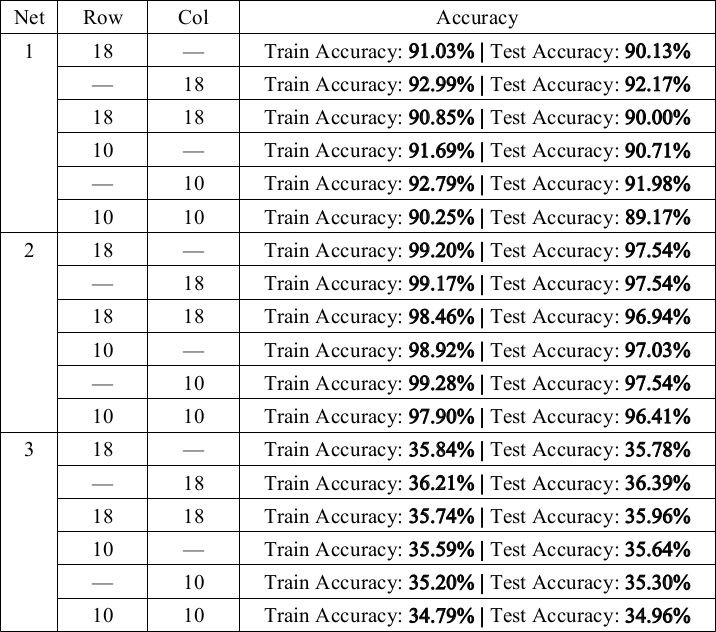
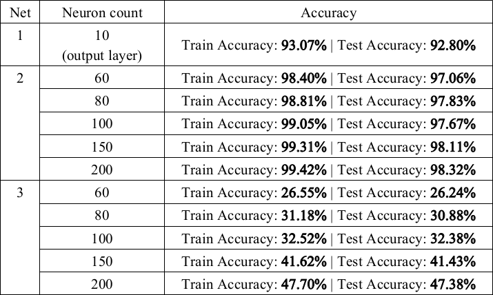
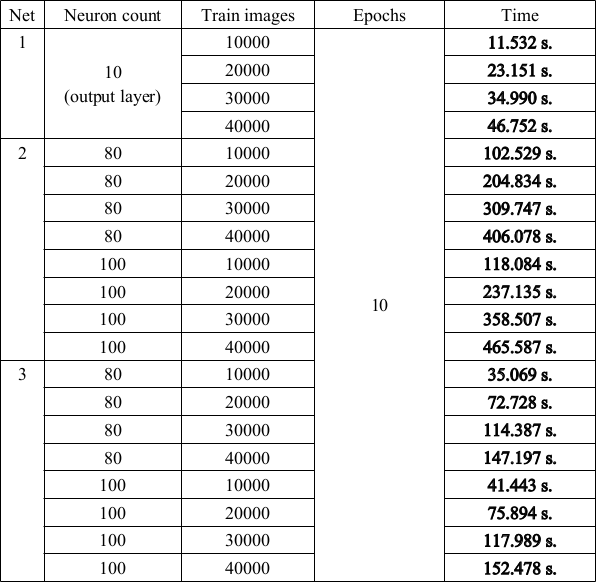
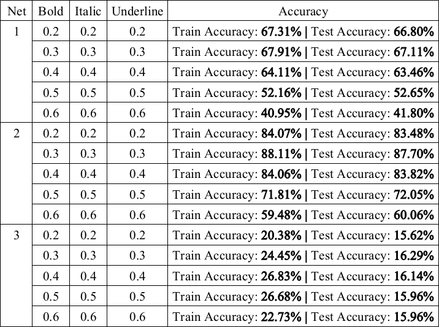

# NN-Data-Classification

[](https://www.python.org/) 

**Note for GitHub users:**  
In a few months, there will be a reworking of all code and results.

## How to run?

### Install requirements
```
numpy==1.19.5
bidict==0.21.2
matplotlib==3.3.4
seaborn==0.11.1
emnist==0.0
scikit-learn==0.24.1
```

### Run
Main example:
```
$ python3.6 main_example.py
```
XOR example:
```
$ python3.6 xor_example.py
```

## Description

The program is designed for data classification by a neural network.  
All data is first converted to a numeric type. If the data are string identifiers, they are converted to numeric identifiers (sequentially starting with 0).

Neural networks used:
1. -needs_refactoring-success?style=flat-square)
    * Layers:
        * Dense
    * Optimizers: 
        * Gradient descent
        * Gradient descent with momentum
        * AdaGrad (Adaptive Gradient Algorithm)
        * AdaDelta (Adaptive Delta)
        * RMSProp (Root Mean Square Propagation)
        * Adam (Adaptive Moment estimation)
        * AdaMax
    * Activation functions:
        * Linear
        * Sigmoid
        * ReLU
        * Tanh
        * SoftMax
        * HardLim
2. -needs_refactoring-success?style=flat-square)
    * Layers:
        * Kohonen
        * Grossberg
    * Distance functions:
        * Euclidean
        * Octile
        * Manhattan (L1)
        * Chebyshev

<br>


* Zeros
* Ones
* Full (user value)
* Standard normal
* Xavier Glorot normal
* Xavier Glorot normal normalized
* Xavier Glorot uniform
* Xavier Glorot uniform normalized
* Kaiming He normal
* Kaiming He uniform

<br>


* MSE (Mean Squared Error)
* SSE (Sum Squared Error)
* MAE (Mean Absolute Error)
* SAE (Sum Absolute Error)
* SDE (for XOR example)

## Results

### MLPClassifier Results (1 layer, «Net 1»)
Choice: train_loss, train_accuracy

|     Dataset     |                          Dataset info                                  | Train Accuracy | Test Accuracy |                               Result Folder                          |
|:---------------:|:----------------------------------------------------------------------:|:--------------:|:-------------:|:--------------------------------------------------------------------:|
| EMNIST Balanced | Train: 112.800<br>Test: 18.800<br>Classes: 47<br>Features: 784 (28x28) |     69.85%     |     67.27%    | /rs/EMNIST/Balanced/One layer/<br>Epochs: 30<br>Time: 1902 s. ≈ 31 m.|
|  EMNIST Letters | Train: 124.800<br>Test: 20.800<br>Classes: 26<br>Features: 784 (28x28) |     70.70%     |     69.39%    |  /rs/EMNIST/Letters/One layer/<br>Epochs: 18<br>Time: 978 s. ≈ 16 m. |
|  EMNIST Digits  | Train: 240.000<br>Test: 40.000<br>Classes: 10<br>Features: 784 (28x28) |     92.67%     |     92.45%    |  /rs/EMNIST/Digits/One layer/<br>Epochs: 4<br>Time: 66 s. ≈ 1 m.     |
|      MNIST      |  Train: 60.000<br>Test: 10.000<br>Classes: 10<br>Features: 784 (28x28) |     93.70%     |     93.01%    |   /rs/EMNIST/MNIST/One layer/<br>Epochs: 98<br>Time: 437 s. ≈ 7 m.   |
|      Sonar      |               Train: 208<br>Classes: 2<br>Features: 60                 |     97.59%     |       —       |      /rs/Sonar Dataset/One layer/<br>Epochs: 763<br>Time: 7 s.       |
|       Wine      |               Train: 178<br>Classes: 3<br>Features: 13                 |      100%      |       —       |           /rs/Wine/One layer/<br>Epochs: 94<br>Time: 0.81 s.         |


### MLPClassifier Results (2 layers, «Net 2»)
Choice: train_loss, train_accuracy

|     Dataset     |                          Dataset info                                  | Train Accuracy | Test Accuracy |                               Result Folder                                          |
|:---------------:|:----------------------------------------------------------------------:|:--------------:|:-------------:|:------------------------------------------------------------------------------------:|
| EMNIST Balanced | Train: 112.800<br>Test: 18.800<br>Classes: 47<br>Features: 784 (28x28) |     89.44%     |     79.79%    | /rs/EMNIST/Balanced/Two layers/<br>Epochs: 98<br>Time: 16990 s. ≈ 5 h.<br>120 neurons|
|  EMNIST Letters | Train: 124.800<br>Test: 20.800<br>Classes: 26<br>Features: 784 (28x28) |     92.78%     |     86.40%    |  /rs/EMNIST/Letters/Two layers/<br>Epochs: 89<br>Time: 15081 s. ≈ 4 h.<br>120 neurons|
|  EMNIST Digits  | Train: 240.000<br>Test: 40.000<br>Classes: 10<br>Features: 784 (28x28) |     99.70%     |     98.76%    |  /rs/EMNIST/Digits/Two layers/<br>Epochs: 91<br>Time: 28746 s. ≈ 8 h.<br>120 neurons |
|      MNIST      |  Train: 60.000<br>Test: 10.000<br>Classes: 10<br>Features: 784 (28x28) |     99.70%     |     98.11%    |   /rs/EMNIST/MNIST/Two layers/<br>Epochs: 100<br>Time: 7808 s. ≈ 2 h.<br>100 neurons |
|      Sonar      |               Train: 208<br>Classes: 2<br>Features: 60                 |      100%      |       —       |      /rs/Sonar Dataset/Two layers/<br>Epochs: 80<br>Time: 1.68 s.<br>80 neurons      |
|       Wine      |               Train: 178<br>Classes: 3<br>Features: 13                 |      100%      |       —       |           /rs/Wine/Two layers/<br>Epochs: 21<br>Time: 0.33 s.<br>80 neurons          |

### CPClassifier Results («Net 3»)
Choice: train_loss, train_accuracy

|     Dataset     |                          Dataset info                                  | Train Accuracy | Test Accuracy |                          Result Folder                                                  |
|:---------------:|:----------------------------------------------------------------------:|:--------------:|:-------------:|:---------------------------------------------------------------------------------------:|
| EMNIST Balanced | Train: 112.800<br>Test: 18.800<br>Classes: 47<br>Features: 784 (28x28) |     31.05%     |     31.12%    | /rs/EMNIST/Balanced/CPN/<br>Epochs: 100<br>Time: 4943 s. ≈ 82 m.<br>120 Kohonen neurons |
|  EMNIST Letters | Train: 124.800<br>Test: 20.800<br>Classes: 26<br>Features: 784 (28x28) |      6.10%     |      5.97%    | /rs/EMNIST/Letters/CPN/<br>Epochs: 100<br>Time: 5285 s. ≈ 88 m.<br>120 Kohonen neurons  |
|  EMNIST Digits  | Train: 240.000<br>Test: 40.000<br>Classes: 10<br>Features: 784 (28x28) |     33.58%     |     33.59%    | /rs/EMNIST/Digits/CPN/<br>Epochs: 100<br>Time: 10038 s. ≈ 3 h.<br>120 Kohonen neurons   |
|      MNIST      |  Train: 60.000<br>Test: 10.000<br>Classes: 10<br>Features: 784 (28x28) |     36.14%     |     36.21%    | /rs/EMNIST/MNIST/CPN/<br>Epochs: 97<br>Time: 2227 s. ≈ 37 m.<br>100 Kohonen neurons     |
|      Sonar      |               Train: 208<br>Classes: 2<br>Features: 60                 |      100%      |       —       |      /rs/Sonar Dataset/CPN/<br>Epochs: 7<br>Time: 4.392 s.<br>200 Kohonen neurons       |
|       Wine      |               Train: 178<br>Classes: 3<br>Features: 13                 |      100%      |       —       |          /rs/Wine/CPN/<br>Epochs: 11<br>Time: 2.613 s.<br>80 Kohonen neurons            |

In the case where the number of neurons of the counter-propagation network coincides with the number of samples, one epoch is enough for an accuracy of 100% (however, such training lasts a very long time; 6 and a half hours per MNIST dataset, size of this network in json ~466.5 MB; in experiments, such a network is not considered).  


### Experiments


1. **Experiment #1**  
   Study of the effect of image deviation from the reference (at different points of the image) on recognition quality. One of the reference images is taken as the original recognized image and adjusted so that there is no one, two, etc., pixels in the image of the reference. The experiment is conducted for several cases (no pixels in different areas of the image) for all standards. In this case, different neural networks are compared.
   
   
2. **Experiment #2**  
   Study of the effect of deviations in the form of noise of one, two, three, etc., pixels in the image on the quality of recognition. One of the references is taken as the original recognizable image and one or more noise pixels are added. The experiment is conducted for different noise locations and for different standards. The experiment also compares different neural networks.
   
   
3. **Experiment #3**  
   Study of the effect of noise and deviations in the form of one, two, three, etc., pixels in the image on the quality of recognition. One of the references is taken as the original recognizable image. A multi-pixel noise is introduced into the image of the image being recognized and several pixels in the character image are deleted. The experiment is repeated for different locations of noise and deviations, and for different standards on different types of neural networks. This experiment is a combination of the first two.
   
   
4. **Experiment #4**  
   Investigate the effect of having a black row or column in the image (as interference in the image) on recognition quality. One of the references is taken as the original recognizable image. The image is filled with a black row or column. The experiment is repeated for different position of row or column in image and for different standards. During the experiment, various neural networks are compared.

   
5. **Experiment #5**  
   Investigate the effect of the presence of a white row or column in the image (as interference in the image) on the quality of recognition. One of the references is taken as the original recognizable image. The image is filled with a white row or column. Experiment is repeated for different position of row or column in image and for different standards on different neural networks.

   
6. **Experiment #6**  
   Investigation of the effect of the number of neurons in layers on recognition quality. The number of neurons in the layer varies from two to some sufficient number. The experiment is repeated on various neural networks.

   
7. **Experiment #7**  
   Investigation of the effect of number of neurons in layers and number of benchmarks on network learning rate. During the experiment, the number of neurons in the layer varies from two to a certain sufficient number, and the number of standards (within the selected range) also varies. In each case, the number of iterations, and the training time are recorded. The experiment is repeated on various neural networks.

   
8. **Experiment #8**  
   Investigate the impact of input pattern drawing on recognition quality. One of the references is taken as the original recognizable image. The standard is modified (bold/slanted/underlined). The experiment is repeated on various neural networks for various modifications.

   

Note: When using color in an image, experiments #4 and #5 should be performed for the background color and image color. In experiment #4, the image color column or row is taken instead of the black row or column. Experiment #5 takes a background color row or column instead of a white row or column.
